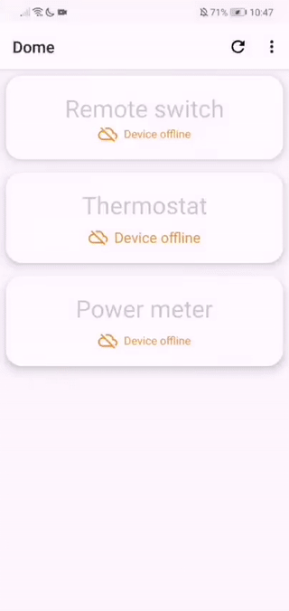
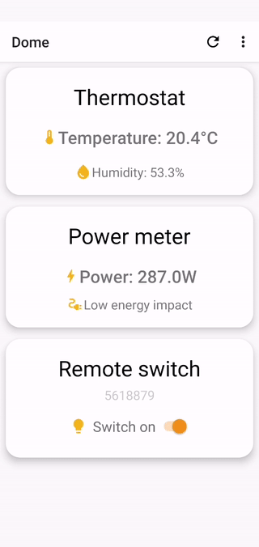
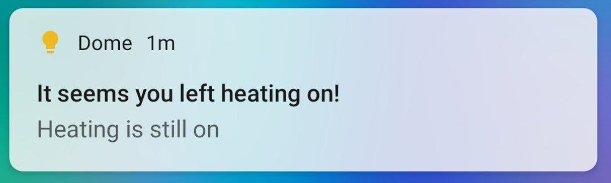
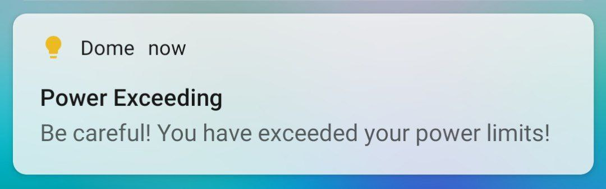

# Dome
## Home automation environment, for makers

Dome let you create and manage MQTT IoT devices with a simple, clean and intuitive interface.

Don't struggle with annoying configuration anymore!

---
## Several features supported: 
- Multiple MQTT topics, one for each house
- Switch from a topic to another with NFC built-in feature!
- Manage and rearrange devices according to your needs
- Monitor house energy consumption from app and display history for current week
- Manage switches
- Manage house heating system
- Power save notifications

---
## How to use:

All you need is WiFi and a MQTT broker; download and install scripts from dome-backend repository on your wifi-enabled arduino device and you're done, or implement yourself Dome interface for each device you want to add.

Contact me for further details.

---
## Screenshots and demo

  

    <figure>
        
        <figcaption>App Overview</figcaption>
    </figure>
  

  

    <figure>
        
        <figcaption>Manage layout</figcaption>
    </figure>
  

## Notifications preview
|||
|:--:|:--:|
|*Heating notifications*|*Power notifiacations*|